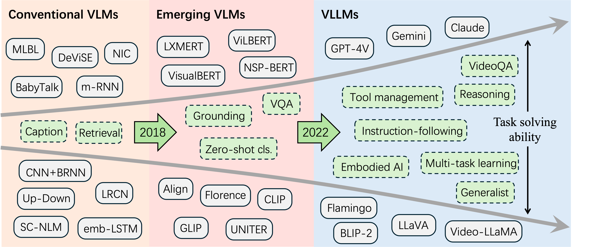

# Awesome Visual Large Language Models (VLLMs)

## 🔥🔥🔥 Visual Large Language Models for Generalized and Specialized Applications

    

## 📢 News

🚀 **What's New in This Update**:

* [2024.12.30]: 🔥 We release our VLLM application paper list repo!

<b> Table of Contents </b> 

- [Visual Large Language Models for Generalized and Specialized Applications](#awesome-vllms)
  - [Existing VLM surveys](#existing-vlm-surveys)
    - [VLM surveys](#vlm-surveys)
    - [MLLM surveys](#mllm-surveys)
  - [Vision-to-text](#vision-to-text)
    - [Image-to-text](#image-to-text)
        - [General domain](#general-domain)
            - [General ability](#general-ability)
            - [REC](#rec)
            - [RES](#res)
            - [OCR](#ocr)
            - [Retrieval](#retrieval)
        - [VLLM+X](#VLLM+X)
            - [Remote sensing](#remote-sensing)
            - [Medical](#medical)
            - [Science and math](#science-and-math)
            - [Graphics and UI](#graphics-and-ui)
            - [Financial analysis](#financial-analysis)
    - [Video-to-text](#video-to-text)
        - [General domain](#general-domain)
        - [Video conversation](#video-conversation)
        - [Egocentric understanding](#egocentric-understanding)
  - [Vision-to-action](#vision-to-action)
      - [Autonomous driving](#autonomous-driving)
        - [Perception](#perception)
        - [Planning](#planning)
        - [Prediction](#prediction)
      - [Embodied AI](#embodied-ai)
        - [Perception](#perception)
        - [Manipulation](#manipulation)
        - [Planning](#planning)
        - [Navigation](#navigation)
      - [Automated tool management](#automated-tool-management)
  - [Text-to-vision](#text-to-vision)
      - [Text-to-image](#text-to-image)
      - [Text-to-3D](#text-to-3D)
      - [Text-to-video](#text-to-video)
  - [Other applications](#other-applications)
      - [Face](#face)
      - [Anomaly Detetcion](#anomaly-detetcion)
      - [Efficiency](#efficiency)

## Existing VLM surveys
### VLM surveys
|  Title  |   Venue  |   Date   |   Code   |   Project   |
|:--------|:--------:|:--------:|:--------:|:--------:|
|   [**Vision-Language Models for Vision Tasks: A Survey**](https://ieeexplore.ieee.org/stamp/stamp.jsp?tp=&arnumber=10445007)   | T-PAMI | 2024-8-8 | Github | [Project](https://github.com/jingyi0000/VLM_survey) |
|    [**Vision + Language Applications: A Survey**](https://openaccess.thecvf.com/content/CVPR2023W/GCV/papers/Zhou_Vision__Language_Applications_A_Survey_CVPRW_2023_paper.pdf)   | CVPRW | 2023-5-24 | Github | [Project](https://github.com/Yutong-Zhou-cv/Awesome-Text-to-Image) |
| [**Vision-and-Language Pretrained Models: A Survey**](https://arxiv.org/pdf/2204.07356.pdf)   | IJCAI (survey track) | 2022-5-3 | Github | Project |

[<u><🎯Back to Top></u>](#head-content)

### MLLM surveys
|  Title  |   Venue  |   Date   |   Code   |   Project   |
|:--------|:--------:|:--------:|:--------:|:--------:|
|    [**A Survey on Multimodal Large Language Models**](https://arxiv.org/pdf/2306.13549.pdf)   | T-PAMI | 2024-11-29 | Github | [Project](https://github.com/BradyFU/Awesome-Multimodal-Large-Language-Models) |
|    [**MME-Survey: A Comprehensive Survey on Evaluation of Multimodal LLMs**](https://arxiv.org/pdf/2411.15296)   | ArXiv | 2024-11-22 | Github | [Project](https://github.com/BradyFU/Awesome-Multimodal-Large-Language-Models/) |
| [**A Survey on Multimodal Large Language Models**](https://academic.oup.com/nsr/advance-article-pdf/doi/10.1093/nsr/nwae403/60676453/nwae403.pdf)   | National Science Review | 2024-11-12 | Github | Project |
| [**Video Understanding with Large Language Models: A Survey**](https://arxiv.org/pdf/2312.17432)   | ArXiv | 2024-6-24 | Github | [Project](https://github.com/yunlong10/Awesome-LLMs-for-Video-Understanding) |
|    [**A Survey on Multimodal Benchmarks: In the Era of Large AI Models**](https://arxiv.org/pdf/2409.18142)   | ArXiv | 2024-9-21 | Github | [Project](https://github.com/HKUST-LongGroup/Awesome-MLLM-Benchmarks) |
|    [**The Revolution of Multimodal Large Language Models: A Survey**](https://arxiv.org/pdf/2402.12451)   | ArXiv | 2024-6-6 | Github | Project |
|    [**A Survey on Hallucination in Large Vision-Language Models**](https://arxiv.org/pdf/2402.00253)   | ArXiv | 2024-5-6 | Github | [Project](https://github.com/lhanchao777/LVLM-Hallucinations-Survey) |
| [**Exploring the Frontier of Vision-Language Models: A Survey of Current Methodologies and Future Directions**](https://arxiv.org/pdf/2404.07214)   | ArXiv | 2024-4-12 | Github | Project |
|    [**MM-LLMs: Recent Advances in MultiModal Large Language Models**](https://arxiv.org/pdf/2401.13601v4)   | ArXiv | 2024-2-20 | Github | [Project](https://mm-llms.github.io/) |
| [**Exploring the Reasoning Abilities of Multimodallarge Language Models (mllms): a Comprehensive survey on Emerging Trends in Multimodal Reasonings**](https://arxiv.org/pdf/2401.06805)   | ArXiv | 2024-1-18 | Github | Project |
| [**Visual Instruction Tuning towards General-Purpose Multimodal Model: A Survey**](https://arxiv.org/pdf/2312.16602)   | ArXiv | 2023-12-27 | Github | Project |
| [**Multimodal Large Language Models: A Survey**](https://ieeexplore.ieee.org/stamp/stamp.jsp?tp=&arnumber=10386743)   | BigData | 2023-12-15 | Github | Project |

[<u><🎯Back to Top></u>](#head-content)

## Vision-to-text
### Image-to-text
#### General domain

##### General ability
|  Name  |  Title  |   Venue  |   Date   |   Code   |   Project   |
|:--------|:--------|:--------:|:--------:|:--------:|:--------:|
| CompCap             | [**CompCap: Improving Multimodal Large Language Models with Composite Captions**](https://arxiv.org/abs/2412.05243)                                      |  ArXiv  | 2024-12-06 |                                       Github                                       |                               Project                               |
| NVILA               | [**NVILA: Efficient Frontier Visual Language Models**](https://arxiv.org/abs/2412.04468)                                                                 |  ArXiv  | 2024-12-05 |                                       Github                                       |                               Project                               |
| Molmo and PixMo     | [**Molmo and PixMo: Open Weights and Open Data for State-of-the-Art Vision-Language Models**](https://arxiv.org/abs/2409.17146)                          |  ArXiv  | 2024-09-25 |                     [Github](https://github.com/allenai/molmo)                     |                               Project                               |
| Qwen2-VL            | [**Qwen2-VL: Enhancing Vision-Language Model’s Perception of the World at Any Resolution**](https://arxiv.org/abs/2408.03326)                            |  ArXiv  | 2024-09-18 |                    [Github](https://github.com/QwenLM/Qwen2-VL)                    |         [Project](https://qwenlm.github.io/blog/qwen2-vl/)          |
| mPLUG-Owl3          | [**mPLUG-Owl3: Towards Long Image-Sequence Understanding in Multi-Modal Large Language Models**](https://arxiv.org/pdf/2404.07214)                       |  ArXiv  | 2024-08-09 |                   [Github](https://github.com/X-PLUG/mPLUG-Owl)                    |                               Project                               |
| LLaVA-OneVision     | [**LLaVA-OneVision: Easy Visual Task Transfer**](https://arxiv.org/abs/2408.03326)                                                                       |  ArXiv  | 2024-08-06 | [Github](https://github.com/LLaVA-VL/LLaVA-NeXT/blob/main/docs/LLaVA_OneVision.md) |                               Project                               |
| VILA$^{2}$          | [**VILA $^2$: VILA Augmented VILA**](https://arxiv.org/pdf/2407.17453)                                                                                   |  ArXiv  | 2024-07-24 |                                       Github                                       |                               Project                               |
| EVLM                | [**EVLM: An Efficient Vision-Language Model for Visual Understanding**](https://arxiv.org/pdf/2407.14177)                                                |  ArXiv  | 2024-07-19 |                                       Github                                       |                               Project                               |
| Cambrian-1          | [**Cambrian-1: A Fully Open, Vision-Centric Exploration of Multimodal LLMs**](https://arxiv.org/pdf/2406.16860)                                          |  ArXiv  | 2024-06-24 |                [Github](https://github.com/cambrian-mllm/cambrian)                 |                               Project                               |
| Ovis                | [**Ovis: Structural Embedding Alignment for Multimodal Large Language Model**](https://arxiv.org/pdf/2405.20797)                                         |  ArXiv  | 2024-05-31 |                     [Github](https://github.com/AIDC-AI/Ovis)                      |                               Project                               |
| ConvLLaVA           | [**ConvLLaVA: Hierarchical Backbones as Visual Encoder for Large Multimodal Models**](https://arxiv.org/pdf/2405.15738)                                  |  ArXiv  | 2024-05-24 |                  [Github](https://github.com/alibaba/conv-llava)                   |                               Project                               |
| Meteor              | [**Meteor: Mamba-based Traversal of Rationale for Large Language and Vision Models**](https://arxiv.org/pdf/2405.15574v1)                                | NeurIPS | 2024-05-24 |                  [Github](https://github.com/ByungKwanLee/Meteor)                  |                               Project                               |
| CuMo                | [**CuMo: Scaling Multimodal LLM with Co-Upcycled Mixture-of-Experts**](https://arxiv.org/pdf/2405.05949)                                                 |  ArXiv  | 2024-05-09 |                     [Github](https://github.com/SHI-Labs/CuMo)                     |                               Project                               |
| Mini-Gemini         | [**Mini-Gemini: Mining the Potential of Multi-modality Vision Language Models**](https://arxiv.org/pdf/2403.18814)                                       |  ArXiv  | 2024-03-27 |                  [Github](https://github.com/dvlab-research/MGM)                   |              [Project](https://mini-gemini.github.io/)              |
| MM1                 | [**MM1: Methods, Analysis & Insights from Multimodal LLM Pre-training**](https://arxiv.org/pdf/2403.09611)                                               |  ArXiv  | 2024-03-14 |                                       Github                                       |                               Project                               |
| DeepSeek-VL         | [**DeepSeek-VL: Towards Real-World Vision-Language Understanding**](https://arxiv.org/pdf/2403.05525)                                                    |  ArXiv  | 2024-03-08 |                [Github](https://github.com/deepseek-ai/DeepSeek-VL)                | [Project](https://huggingface.co/spaces/deepseek-ai/DeepSeek-VL-7B) |
| InternLM-XComposer2 | [**InternLM-XComposer2: Mastering Free-form Text-Image Composition and Comprehension in Vision-Language Large Model**](https://arxiv.org/pdf/2401.16420) |  ArXiv  | 2024-01-29 |              [Github](https://github.com/InternLM/InternLM-XComposer)              |                               Project                               |
| MoE-LLaVA           | [**MoE-LLaVA: Mixture of Experts for Large Vision-Language Models**](https://arxiv.org/pdf/2401.15947)                                                   |  ArXiv  | 2024-01-29 |                [Github](https://github.com/PKU-YuanGroup/MoE-LLaVA)                |                               Project                               |
| InternVL            | [**InternVL: Scaling up Vision Foundation Models and Aligning for Generic Visual-Linguistic Tasks**](https://arxiv.org/pdf/2312.14238)                   |  CVPR   | 2023-12-21 |                  [Github](https://github.com/OpenGVLab/InternVL)                   |        [Project](https://internvl.readthedocs.io/en/latest/)        |
| VILA                | [**VILA: On Pre-training for Visual Language Models**](https://arxiv.org/pdf/2312.07533)                                                                 |  ArXiv  | 2023-12-12 |                      [Github](https://github.com/NVlabs/VILA)                      |                               Project                               |
| Vary                | [**Vary: Scaling up the Vision Vocabulary for Large Vision-Language Models**](https://arxiv.org/pdf/2312.06109)                                          |  ECCV   | 2023-12-11 |                  [Github](https://github.com/Ucas-HaoranWei/Vary)                  |                               Project                               |
| Honeybee            | [**Honeybee: Locality-enhanced Projector for Multimodal LLM**](https://arxiv.org/pdf/2312.06742)                                                         |  CVPR   | 2023-11-11 |                    [Github](https://github.com/khanrc/honeybee)                    |                               Project                               |
| OtterHD             | [**OtterHD: A High-Resolution Multi-modality Model**](https://arxiv.org/pdf/2311.04219)                                                                  |  ArXiv  | 2023-11-07 |                     [Github](https://github.com/Luodian/Otter)                     |                               Project                               |
| mPLUG-Owl2          | [**mPLUG-Owl2: Revolutionizing Multi-modal Large Language Model with Modality Collaboration**](https://arxiv.org/pdf/2404.07214)                         |  CVPR   | 2023-11-07 |                   [Github](https://github.com/X-PLUG/mPLUG-Owl)                    |                               Project                               |
| Fuyu                | [**Fuyu-8B: A Multimodal Architecture for AI Agents**](https://www.adept.ai/blog/fuyu-8b)                                                                |  ArXiv  | 2023-10-17 |                   [Github](https://huggingface.co/adept/fuyu-8b)                   |            [Project](https://www.adept.ai/blog/fuyu-8b)             |
| MiniGPT-v2          | [**MiniGPT-v2: large language model as a unified interface for vision-language multi-task learning**](https://arxiv.org/pdf/2310.09478)                  |  ArXiv  | 2023-10-14 |                 [Github](https://github.com/Vision-CAIR/MiniGPT-4)                 |               [Project](https://minigpt-4.github.io/)               |
| LLaVA 1.5           | [**Improved Baselines with Visual Instruction Tuning**](https://arxiv.org/pdf/2310.03744)                                                                |  ArXiv  | 2023-10-05 |                   [Github](https://github.com/haotian-liu/LLaVA)                   |               [Project](https://llava-vl.github.io/)                |
| InternLM-XComposer  | [**InternLM-XComposer: A Vision-Language Large Model for Advanced Text-image Comprehension and Composition**](https://arxiv.org/pdf/2309.15112)          |  ArXiv  | 2023-09-26 |              [Github](https://github.com/InternLM/InternLM-XComposer)              |                               Project                               |
| Qwen-VL             | [**Qwen-VL: A Versatile Vision-Language Model for Understanding, Localization, Text Reading, and Beyond**](https://arxiv.org/pdf/2308.12966)             |  ArXiv  | 2023-08-24 |                    [Github](https://github.com/QwenLM/Qwen-VL)                     |                               Project                               |
| StableLLaVA         | [**StableLLaVA: Enhanced Visual Instruction Tuning with Synthesized Image-Dialogue Data**](https://arxiv.org/pdf/2308.10253)                             |  ArXiv  | 2023-08-20 |                  [Github](https://github.com/icoz69/StableLLAVA)                   |      [Project](https://icoz69.github.io/stablellava-official/)      |
| BLIVA               | [**BLIVA: A Simple Multimodal LLM for Better Handling of Text-Rich Visual Questions**](https://arxiv.org/pdf/2308.09936)                                 |  AAAI   | 2023-08-19 |                    [Github](https://github.com/mlpc-ucsd/BLIVA)                    |                               Project                               |
| SVIT                | [**SVIT: Scaling up Visual Instruction Tuning**](https://arxiv.org/pdf/2307.04087)                                                                       |  ArXiv  | 2023-07-09 |          [Github](https://github.com/BAAI-DCAI/Visual-Instruction-Tuning)          |                               Project                               |
| LaVIN               | [**Cheap and Quick: Efficient Vision-Language Instruction Tuning for Large Language Models**](https://arxiv.org/pdf/2305.15023)                          | NeurIPS | 2023-05-24 |                   [Github](https://github.com/luogen1996/LaVIN)                    |                               Project                               |
| InstructBLIP        | [**InstructBLIP: Towards General-purpose Vision-Language Models with Instruction Tuning**](https://arxiv.org/pdf/2404.07214)                             | NeurIPS | 2023-05-11 |   [Github](https://github.com/salesforce/LAVIS/tree/main/projects/instructblip)    |                               Project                               |
| MultiModal-GPT      | [**MultiModal-GPT: A Vision and Language Model for Dialogue with Humans**](https://arxiv.org/pdf/2404.07214)                                             |  ArXiv  | 2023-05-08 |               [Github](https://github.com/open-mmlab/Multimodal-GPT)               |                               Project                               |
| Otter               | [**Otter: A Multi-Modal Model with In-Context Instruction Tuning**](https://arxiv.org/pdf/2305.03726)                                                    |  ArXiv  | 2023-05-05 |                     [Github](https://github.com/Luodian/Otter)                     |                               Project                               |
| mPLUG-Owl           | [**mPLUG-Owl: Modularization Empowers Large Language Models with Multimodality**](https://arxiv.org/pdf/2304.14178)                                      |  ArXiv  | 2023-04-27 |                   [Github](https://github.com/X-PLUG/mPLUG-Owl)                    |                               Project                               |
| LLaMA-Adapter V2    | [**LLaMA-Adapter V2: Parameter-Efficient Visual Instruction Model**](https://arxiv.org/pdf/2304.15010)                                                   |  ArXiv  | 2023-04-28 |              [Github](https://github.com/ZrrSkywalker/LLaMA-Adapter)               |                               Project                               |
| MiniGPT-4           | [**MiniGPT-4: Enhancing Vision-Language Understanding with Advanced Large Language Models**](https://arxiv.org/pdf/2404.07214)                           | NeurIPS | 2023-04-20 |                 [Github](https://github.com/Vision-CAIR/MiniGPT-4)                 |               [Project](https://minigpt-4.github.io/)               |
| LLaVA               | [**Visual Instruction Tuning**](https://arxiv.org/pdf/2304.08485)                                                                                        | NeurIPS | 2023-04-17 |                   [Github](https://github.com/haotian-liu/LLaVA)                   |               [Project](https://llava-vl.github.io/)                |
| LLaMA-Adapter       | [**LLaMA-Adapter: Efficient Fine-tuning of Large Language Models with Zero-initialized Attention**](https://arxiv.org/pdf/2303.16199)                    |  ICLR   | 2023-03-28 |              [Github](https://github.com/ZrrSkywalker/LLaMA-Adapter)               |                               Project                               |
| Kosmos-1            | [**Language Is Not All You Need: Aligning Perception with Language Models**](https://arxiv.org/pdf/2302.14045)                                           | NeurIPS | 2023-02-27 |                    [Github](https://github.com/microsoft/unilm)                    |                               Project                               |
| Flamingo            | [**Flamingo: a Visual Language Model for Few-Shot Learning**](https://arxiv.org/pdf/2204.14198)                                                          | NeurIPS | 2022-04-29 |              [Github](https://github.com/mlfoundations/open_flamingo)              |                               Project                               |

[<u><🎯Back to Top></u>](#head-content)

##### REC

| Model       | Title                                                                                                                                                |  Venue  |    Date    |                                          Code                                           |                         Project                         |
| :---------- | :--------------------------------------------------------------------------------------------------------------------------------------------------- | :-----: | :--------: | :-------------------------------------------------------------------------------------: | :-----------------------------------------------------: |
| OMG-LLaVA   | [**OMG-LLaVA: Bridging Image-level, Object-level, Pixel-level Reasoning and Understanding**](https://arxiv.org/pdf/2406.19389)                       | NeurIPS | 2024-06-27 |                       [Github](https://github.com/lxtGH/OMG-Seg)                        |  [Project](https://lxtgh.github.io/project/omg_llava/)  |
| VisionLLMv2 | [**VisionLLM v2: An End-to-End Generalist Multimodal Large Language Model for Hundreds of Vision-Language Tasks**](https://arxiv.org/pdf/2406.08394) |  ArXiv  | 2024-06-12 |                    [Github](https://github.com/OpenGVLab/VisionLLM)                     | [Project](https://shramanpramanick.github.io/VistaLLM/) |
| LLM-Seg     | [**LLM-Seg: Bridging Image Segmentation and Large Language Model Reasoning**](https://arxiv.org/pdf/2404.08767)                                      |  CVPR   | 2024-04-12 |      [Github](https://www.google.com/search?q=LLM-Seg%5C&sourceid=chrome&ie=UTF-8)      |                         Project                         |
| PSALM       | [**PSALM: Pixelwise SegmentAtion with Large Multi-Modal Model**](https://arxiv.org/pdf/2403.14598)                                                   |  ECCV   | 2024-03-21 |                       [Github](https://github.com/zamling/PSALM)                        |          [Project](https://pixellm.github.io/)          |
| GROUNDHOG   | [**GROUNDHOG: Grounding Large Language Models to Holistic Segmentation**](https://arxiv.org/pdf/2402.16846)                                          |  CVPR   | 2024-02-26 |                      [Github](https://github.com/LeapLabTHU/GSVA)                       |      [Project](https://groundhog-mllm.github.io/)       |
| GELLA       | [**Generalizable Entity Grounding via Assistance of Large Language Model**](https://arxiv.org/pdf/2402.02555)                                        |  ECCV   | 2024-02-04 |                                         Github                                          |                         Project                         |
| OMG-Seg     | [**OMG-Seg: Is One Model Good Enough For All Segmentation?**](https://arxiv.org/pdf/2401.10229)                                                      |  CVPR   | 2024-01-18 |                       [Github](https://github.com/lxtGH/OMG-Seg)                        |   [Project](https://lxtgh.github.io/project/omg_seg/)   |
| LISA++      | [**LISA++: An Improved Baseline for Reasoning Segmentation with Large Language Model**](https://arxiv.org/pdf/2312.17240)                            |  ArXiv  | 2023-12-28 |                    [Github](https://github.com/dvlab-research/LISA)                     |                         Project                         |
| VistaLLM    | [**Jack of All Tasks, Master of Many: Designing General-purpose Coarse-to-Fine Vision-Language Model**](https://arxiv.org/pdf/2312.12423)            |  ECCV   | 2023-12-19 |                    [Github](https://github.com/OpenGVLab/VisionLLM)                     | [Project](https://shramanpramanick.github.io/VistaLLM/) |
| Osprey      | [**Osprey: Pixel Understanding with Visual Instruction Tuning**](https://arxiv.org/pdf/2312.10032)                                                   |  CVPR   | 2023-12-15 |                     [Github](https://github.com/CircleRadon/Osprey)                     |                         Project                         |
| GSVA        | [**GSVA: Generalized Segmentation via Multimodal Large Language Models**](https://arxiv.org/abs/2312.10103)                                          |  CVPR   | 2023-12-05 |                      [Github](https://github.com/LeapLabTHU/GSVA)                       |                         Project                         |
| PixelLM     | [**PixelLM: Pixel Reasoning with Large Multimodal Model**](https://arxiv.org/pdf/2312.02228)                                                         |  CVPR   | 2023-12-04 |                    [Github](https://github.com/MaverickRen/PixelLM)                     |          [Project](https://pixellm.github.io/)          |
| PixelLLM    | [**PixelLM: Pixel Reasoning with Large Multimodal Model**](https://arxiv.org/pdf/2312.02228)                                                         |  ECCV   | 2023-12-04 | [Github](https://github.com/google-research/scenic/tree/main/scenic/projects/pixel_llm) |        [Project](https://jerryxu.net/PixelLLM/)         |
| LLaFS       | [**LLaFS: When Large Language Models Meet Few-Shot Segmentation**](https://arxiv.org/pdf/2311.16926)                                                 |  CVPR   | 2023-11-28 |                     [Github](https://github.com/lanyunzhu99/LLaFS)                      |                         Project                         |
| NExT-Chat   | [**NExT-Chat: An LMM for Chat, Detection and Segmentation**](https://arxiv.org/pdf/2311.04498)                                                       |  ArXiv  | 2023-11-08 |                    [Github](https://github.com/NExT-ChatV/NExT-Chat)                    |        [Project](https://next-chatv.github.io/)         |
| GLaMM       | [**GLaMM: Pixel Grounding Large Multimodal Model**](https://arxiv.org/pdf/2311.03356)                                                                |  CVPR   | 2023-11-06 |                  [Github](https://github.com/mbzuai-oryx/groundingLMM)                  | [Project](https://mbzuai-oryx.github.io/groundingLMM/)  |
| LISA        | [**LISA: Reasoning Segmentation via Large Language Model**](https://arxiv.org/pdf/2308.00692)                                                        |  CVPR   | 2023-08-01 |                    [Github](https://github.com/dvlab-research/LISA)                     |                         Project                         |
| ContextDET  | [**Contextual Object Detection with Multimodal Large Language Models**](https://arxiv.org/pdf/2305.18279)                                            |  ArXiv  | 2023-05-29 |                   [Github](https://github.com/yuhangzang/ContextDET)                    |                         Project                         |
| VisionLLM   | [**VisionLLM: Large Language Model is also an Open-Ended Decoder for Vision-Centric Tasks**](https://arxiv.org/pdf/2305.11175)                       |  ArXiv  | 2023-05-18 |                    [Github](https://github.com/OpenGVLab/VisionLLM)                     |                         Project                         |

[<u><🎯Back to Top></u>](#head-content)

##### RES

| Model               | Title                                                                                                                                                |  Venue  |    Date    | Code                                                              | Project                                                 |
| :------------------ | :--------------------------------------------------------------------------------------------------------------------------------------------------- | :-----: | :--------: | :---------------------------------------------------------------- | :------------------------------------------------------ |
| ChatRex         | [**ChatRex: Taming Multimodal LLM for Joint Perception and Understanding**](https://arxiv.org/abs/2411.18363)                                        |  ArXiv  | 2024-11-27 | [Github](https://github.com/IDEA-Research/ChatRex)                | Project                                                 |
| Griffon-G       | [**Griffon-G: Bridging Vision-Language and Vision-Centric Tasks via Large Multimodal Models**](https://arxiv.org/abs/2410.16163)                     |  ArXiv  | 2024-10-21 | [Github](https://github.com/jefferyZhan/Griffon)                  | Project                                                 |
| Ferret          | [**Ferret: Refer and Ground Anything Anywhere at Any Granularity**](https://arxiv.org/pdf/2310.07704)                                                |  ICLR   | 2024-10-11 | [Github](https://github.com/apple/ml-ferret)                      | Project                                                 |
| OMG-LLaVA       | [**OMG-LLaVA: Bridging Image-level, Object-level, Pixel-level Reasoning and Understanding**](https://arxiv.org/pdf/2406.19389)                       | NeurIPS | 2024-06-27 | [Github](https://github.com/lxtGH/OMG-Seg)                        | [Project](https://lxtgh.github.io/project/omg_llava/)   |
| VisionLLMv2     | [**VisionLLM v2: An End-to-End Generalist Multimodal Large Language Model for Hundreds of Vision-Language Tasks**](https://arxiv.org/pdf/2406.08394) |  ArXiv  | 2024-06-12 | [Github](https://github.com/OpenGVLab/VisionLLM)                  | Project                                                 |
| Groma           | [**Groma: Localized Visual Tokenization for Grounding Multimodal Large Language Models**](https://arxiv.org/abs/2404.13013)                          |  ECCV   | 2024-04-19 | [Github](https://github.com/FoundationVision/Groma)               | Project                                                 |
| Griffonv2       | [**Griffon v2: Advancing Multimodal Perception with High-Resolution Scaling and Visual-Language Co-Referring**](https://arxiv.org/abs/2403.09333)    |  ArXiv  | 2024-03-14 | [Github](https://github.com/jefferyZhan/Griffon)                  | Project                                                 |
| ASMv2           | [**The All-Seeing Project V2: Towards General Relation Comprehension of the Open World**](https://arxiv.org/pdf/2402.19474)                          |  ECCV   | 2024-02-29 | [Github](https://github.com/OpenGVLab/all-seeing)                 | Project                                                 |
| SPHINX-X        | [**SPHINX-X: Scaling Data and Parameters for a Family of Multi-modal Large Language Models**](https://arxiv.org/abs/2402.05935)                      |  ArXiv  | 2024-02-08 | [Github](https://github.com/sphinx-doc/sphinx)                    | Project                                                 |
| ChatterBox      | [**ChatterBox: Multi-round Multimodal Referring and Grounding**](https://arxiv.org/abs/2401.13307)                                                   |  ArXiv  | 2024-01-24 | [Github](https://github.com/sunsmarterjie/ChatterBox)             | Project                                                 |
| LEGO            | [**LEGO: Language Enhanced Multi-modal Grounding Model**](https://arxiv.org/pdf/2401.06071v2)                                                        |  ArXiv  | 2024-01-12 | [Github](https://github.com/standardgalactic/lego)                | Project                                                 |
| GroundingGPT    | [**GroundingGPT: Language Enhanced Multi-modal Grounding Model**](https://arxiv.org/abs/2401.06071)                                                  |   ACL   | 2024-01-11 | [Github](https://github.com/standardgalactic/lego)                | Project                                                 |
| BuboGPT         | [**BuboGPT: Enabling Visual Grounding in Multi-Modal LLMs**](https://arxiv.org/pdf/2307.08581)                                                       |  ArXiv  | 2024-07-17 | [Github](https://github.com/magic-research/bubogpt)               | [Project](https://bubo-gpt.github.io/)                  |
| Ferret-v2       | [**Ferret-v2: An Improved Baseline for Referring and Grounding with Large Language Models**](https://arxiv.org/pdf/2404.07973)                       |  COLM   | 2024-04-11 | [Github](https://github.com/apple/ml-ferret)                      | Project                                                 |
| InfMLLM         | [**InfLLM: Training-Free Long-Context Extrapolation for LLMs with an Efficient Context Memory**](https://arxiv.org/pdf/2402.04617)                   | NeurIPS | 2024-02-07 | [Github](https://github.com/thunlp/InfLLM)                        | Project                                                 |
| VistaLLM        | [**Jack of All Tasks, Master of Many: Designing General-purpose Coarse-to-Fine Vision-Language Model**](https://arxiv.org/pdf/2312.12423)            |  ECCV   | 2023-12-19 | Github                                                            | [Project](https://shramanpramanick.github.io/VistaLLM/) |
| LLaVA-Grounding | [**LLaVA-Grounding: Grounded Visual Chat with Large Multimodal Models**](https://arxiv.org/abs/2312.02949)                                           |  ArXiv  | 2023-12-05 | [Github](https://github.com/UX-Decoder/LLaVA-Grounding)           | [Project](https://llava-vl.github.io/llava-grounding/)  |
| Lenna           | [**Lenna: Language Enhanced Reasoning Detection Assistant**](https://arxiv.org/abs/2312.02433)                                                       |  ArXiv  | 2023-12-05 | [Github](https://github.com/Meituan-AutoML/Lenna)                 | Project                                                 |
| Griffon         | [**Griffon: Spelling out All Object Locations at Any Granularity with Large Language Models**](https://arxiv.org/abs/2311.14552)                     |  ECCV   | 2023-11-24 | [Github](https://github.com/jefferyZhan/Griffon)                  | Project                                                 |
| Lion            | [**Lion: Empowering multimodal large language model with dual-level visual knowledge**](https://arxiv.org/abs/2311.11860)                            |  CVPR   | 2023-11-20 | [Github](https://github.com/JiuTian-VL/JiuTian-LION)              | Project                                                 |
| SPHINX          | [**SPHINX: The Joint Mixing of Weights, Tasks, and Visual Embeddings for Multi-modal Large Language Models**](https://arxiv.org/abs/2311.07575)      |  ArXiv  | 2023-11-13 | [Github]()                                                        | Project                                                 |
| NExT-Chat       | [**NExT-Chat: An LMM for Chat, Detection and Segmentation**](https://arxiv.org/pdf/2311.04498)                                                       |  ArXiv  | 2023-11-08 | [Github](https://github.com/NExT-ChatV/NExT-Chat)                 | [Project](https://next-chatv.github.io/)                |
| GLaMM           | [**GLaMM: Pixel Grounding Large Multimodal Model**](https://arxiv.org/pdf/2311.03356)                                                                |  CVPR   | 2023-11-06 | [Github](https://github.com/mbzuai-oryx/groundingLMM)             | [Project](https://mbzuai-oryx.github.io/groundingLMM/)  |
| CogVLM          | [**CogVLM: Visual Expert for Pretrained Language Models**](https://arxiv.org/pdf/2311.03079)                                                         |  ArXiv  | 2023-11-06 | [Github](https://github.com/THUDM/CogVLM)                         | Project                                                 |
| Pink            | [**Pink: Unveiling the Power of Referential Comprehension for Multi-modal LLMs**](https://arxiv.org/pdf/2310.00582)                                  |  CVPR   | 2023-10-01 | [Github](https://github.com/SY-Xuan/Pink)                         | Project                                                 |
| PVIT            | [**Position-Enhanced Visual Instruction Tuning for Multimodal Large Language Models**](https://arxiv.org/pdf/2308.13437)                             |  ArXiv  | 2023-08-25 | [Github](https://github.com/PVIT-official/PVIT)                   | Project                                                 |
| ASM             | [**The all-seeing project: Towards panoptic visual recognition and understanding of the open world**](https://arxiv.org/pdf/2308.01907)              |  ICLR   | 2023-08-03 | [Github](https://github.com/OpenGVLab/all-seeing)                 | Project                                                 |
| Shikra          | [**Shikra: Unleashing Multimodal LLM's Referential Dialogue Magic**](https://arxiv.org/pdf/2306.15195)                                               |  ArXiv  | 2023-06-27 | [Github](https://github.com/shikras/shikra)                       | Project                                                 |
| Kosmos-2        | [**KOSMOS-2: Grounding Multimodal Large LanguageModels to the World**](https://arxiv.org/pdf/2306.14824)                                             |  ICLR   | 2023-06-26 | [Github](https://github.com/microsoft/unilm/tree/master/kosmos-2) | Project                                                 |
| ChatSpot        | [**ChatSpot: Bootstrapping Multimodal LLMs via Precise Referring Instruction Tuning**](https://arxiv.org/pdf/2307.09474)                             |  ArXiv  | 2023-07-18 | [Github](https://github.com/Ahnsun/ChatSpot)                      | Project                                                 |
| GPT4RoI         | [**GPT4RoI: Instruction Tuning Large Language Model on Region-of-Interest**](https://arxiv.org/pdf/2307.03601)                                       |  IJCAI  | 2023-07-07 | [Github](https://github.com/jshilong/GPT4RoI)                     | Project                                                 |
| ContextDET      | [**Contextual Object Detection with Multimodal Large Language Models**](https://arxiv.org/pdf/2305.18279)                                            |  ArXiv  | 2023-05-29 | [Github](https://github.com/yuhangzang/ContextDET)                | Project                                                 |
| DetGPT          | [**DetGPT: Detect What You Need via Reasoning**](https://arxiv.org/pdf/2305.14167)                                                                   |  ArXiv  | 2023-05-23 | [Github](https://github.com/OptimalScale/DetGPT)                  | [Project](https://detgpt.github.io/)                    |
| VisionLLM       | [**VisionLLM: Large Language Model is also an Open-Ended Decoder for Vision-Centric Tasks**](https://arxiv.org/pdf/2305.11175)                       |  ArXiv  | 2023-05-18 | [Github](https://github.com/OpenGVLab/VisionLLM)                  | Project                                                 |

[<u><🎯Back to Top></u>](#head-content)

##### OCR

| Model                    | Title                                                                                                                                                         |  Venue  |    Date    |                                             Code                                             |               Project                |
| :----------------------- | :------------------------------------------------------------------------------------------------------------------------------------------------------------ | :-----: | :--------: | :------------------------------------------------------------------------------------------: | :----------------------------------: |
| TextHawk2                | [**TextHawk2: A Large Vision-Language Model Excels in Bilingual OCR and Grounding with 16x Fewer Tokens**](https://arxiv.org/abs/2410.05261)                  |  ArXiv  | 2024-10-07 |                         [Github](https://github.com/yuyq96/TextHawk)                         |               Project                |
| Dockylin                 | [**DocKylin: A Large Multimodal Model for Visual Document Understanding with Efficient Visual Slimming**](https://arxiv.org/abs/2406.19101)                   |  AAAI   | 2024-06-27 |                       [Github](https://github.com/ZZZHANG-jx/DocKylin)                       |               Project                |
| StrucTexTv3              | [**StrucTexTv3: An Efficient Vision-Language Model for Text-rich Image Perception, Comprehension, and Beyond**](https://arxiv.org/abs/2405.21013)             |  ArXiv  | 2024-05-31 |                                          [Github]()                                          |               Project                |
| Fox                      | [**Focus Anywhere for Fine-grained Multi-page Document Understanding**](https://arxiv.org/abs/2405.14295)                                                     |  ArXiv  | 2024-05-23 |                           [Github](https://github.com/ucaslcl/Fox)                           |               Project                |
| TextMonkey               | [**TextMonkey: An OCR-Free Large Multimodal Model for Understanding Document**](https://arxiv.org/abs/2403.04473)                                             |  ArXiv  | 2024-05-07 | [Github](https://github.com/Yuliang-Liu/Monkey/blob/main/monkey_model/text_monkey/README.md) |               Project                |
| TinyChart                | [**TinyChart: Efficient Chart Understanding with Visual Token Merging and Program-of-Thoughts Learning**](https://arxiv.org/abs/2404.16635)                   |   ACL   | 2024-04-25 |                       [Github](https://github.com/X-PLUG/mPLUG-DocOwl)                       |               Project                |
| TextHawk                 | [**TextHawk: Exploring Efficient Fine-Grained Perception of Multimodal Large Language Models**](https://arxiv.org/abs/2404.09204)                             |  ArXiv  | 2024-04-14 |                         [Github](https://github.com/yuyq96/TextHawk)                         |               Project                |
| HRVDA                    | [**HRVDA: High-Resolution Visual Document Assistant**](https://arxiv.org/abs/2404.06918)                                                                      |  CVPR   | 2024-04-10 |                                          [Github]()                                          |               Project                |
| InternLM-XComposer2-4KHD | [**InternLM-XComposer2-4KHD: A Pioneering Large Vision-Language Model Handling Resolutions from 336 Pixels to 4K HD**](https://arxiv.org/abs/2404.06512)      | NeurIPS | 2024-04-09 |                   [Github](https://github.com/InternLM/InternLM-XComposer)                   |               Project                |
| LayoutLLM                | [**LayoutLLM: Layout Instruction Tuning with Large Language Models for Document Understanding**](https://arxiv.org/abs/2404.05225)                            |  CVPR   | 2024-04-08 |                                          [Github]()                                          |               Project                |
| ViTLP                    | [**Visually Guided Generative Text-Layout Pre-training for Document Intelligence**](https://arxiv.org/abs/2403.16516)                                         |  NAACL  | 2024-03-25 |                    [Github](https://github.com/Veason-silverbullet/ViTLP)                    |               Project                |
| mPLUG-DocOwl 1.5         | [**mPLUG-DocOwl 1.5: Unified Structure Learning for OCR-free Document Understanding**](https://arxiv.org/abs/2403.12895)                                      |  ArXiv  | 2024-03-19 |                       [Github](https://github.com/X-PLUG/mPLUG-DocOwl)                       |               Project                |
| DoCo                     | [**Enhancing Visual Document Understanding with Contrastive Learning in Large Visual-Language Models**](https://arxiv.org/abs/2402.19014)                     |  CVPR   | 2024-02-29 |                                          [Github]()                                          |               Project                |
| TGDoc                    | [**Towards Improving Document Understanding: An Exploration on Text-Grounding via MLLMs**](https://arxiv.org/abs/2311.13194)                                  |  ArXiv  | 2023-11-22 |                         [Github](https://github.com/harrytea/TGDoc)                          |               Project                |
| DocPedia                 | [**DocPedia: Unleashing the Power of Large Multimodal Model in the Frequency Domain for Versatile Document Understanding**](https://arxiv.org/abs/2311.11810) |  ArXiv  | 2023-11-20 |                                          [Github]()                                          |               Project                |
| UReader                  | [**UReader: Universal OCR-free Visually-situated Language Understanding with Multimodal Large Language Model**](https://arxiv.org/abs/2310.05126)             |   ACL   | 2023-10-08 |                    [Github](https://github.com/LukeForeverYoung/UReader)                     |               Project                |
| UniDoc                   | [**UniDoc: A Universal Large Multimodal Model for Simultaneous Text Detection, Recognition, Spotting and Understanding**](https://arxiv.org/abs/2308.11592)   |  ArXiv  | 2023-08-19 |                                          [Github]()                                          |               Project                |
| mPLUG-DocOwl             | [**mPLUG-DocOwl: Modularized Multimodal Large Language Model for Document Understanding**](https://arxiv.org/abs/2307.02499)                                  |  ArXiv  | 2023-07-04 |                       [Github](https://github.com/X-PLUG/mPLUG-DocOwl)                       |               Project                |
| LLaVAR                   | [**LLaVAR: Enhanced Visual Instruction Tuning for Text-Rich Image Understanding**](https://arxiv.org/abs/2306.17107)                                          |  ArXiv  | 2023-06-29 |                         [Github](https://github.com/SALT-NLP/LLaVAR)                         | [Project](https://llavar.github.io/) |

[<u><🎯Back to Top></u>](#head-content)

##### Retrieval

| Model      | Title                                                                                                               | Venue |    Date    |                      Code                       |                     Project                      |
| :--------- | :------------------------------------------------------------------------------------------------------------------ | :---: | :--------: | :---------------------------------------------: | :----------------------------------------------: |
| EchoSight  | [**EchoSight: Advancing Visual-Language Models with Wiki Knowledge**](https://arxiv.org/abs/2407.12735)             | EMNLP | 2024-07-17 | [Github](https://github.com/Go2Heart/EchoSight) | [Project](https://go2heart.github.io/echosight/) |
| FROMAGe    | [**Grounding Language Models to Images for Multimodal Inputs and Outputs**](https://arxiv.org/abs/2301.13823)       | ICML  | 2024-01-31 | [Github](https://github.com/kohjingyu/fromage)  |                     Project                      |
| Wiki-LLaVA | [**Wiki-LLaVA: Hierarchical Retrieval-Augmented Generation for Multimodal LLMs**](https://arxiv.org/abs/2404.15406) | CVPR  | 2023-04-23 |                   [Github]()                    |                     Project                      |
| UniMuR     | [**Unified Embeddings for Multimodal Retrieval via Frozen LLMs**](https://arxiv.org/abs/1905.03197)                 | ICML  | 2019-05-08 |                   [Github]()                    |                     Project                      |

[<u><🎯Back to Top></u>](#head-content)

#### VLLM + X
##### Remote sensing
|  Name  |  Title  |   Venue  |   Date   |   Code   |   Project   |
|:--------|:--------|:--------:|:--------:|:--------:|:--------:|
| VHM |    [**VHM: Versatile and Honest Vision Language Model for Remote Sensing Image Analysis**](https://arxiv.org/pdf/2403.20213)   | ArXiv | 2024-11-06 | [Github](https://github.com/opendatalab/VHM) | [Project](https://fitzpchao.github.io/vhm_page/) |
| LHRS-Bot |    [**LHRS-Bot: Empowering Remote Sensing with VGI-Enhanced Large Multimodal Language Model**](https://arxiv.org/pdf/2402.02544)   | ECCV | 2024-07-16 | [Github](https://github.com/NJU-LHRS/LHRS-Bot) | Project |
| Popeye | [**Popeye: A Unified Visual-Language Model for Multi-Source Ship Detection from Remote Sensing Imagery**](https://arxiv.org/pdf/2403.03790)   | J-STARS | 2024-06-13 | Github | Project |
| RS-LLaVA |    [**RS-LLaVA: A Large Vision-Language Model for Joint Captioning and Question Answering in Remote Sensing Imagery**](https://www.mdpi.com/2072-4292/16/9/1477)   | Remote Sens. | 2024-04-23 | [Github](https://github.com/BigData-KSU/RS-LLaVA) | Project |
| EarthGPT |    [**EarthGPT: A Universal Multi-modal Large Language Model for Multi-sensor Image Comprehension in Remote Sensing Domain**](https://arxiv.org/pdf/2401.16822)   | TGRS | 2024-03-08 | [Github](https://github.com/wivizhang/EarthGPT) | Project |
| RS-CapRet | [**Large Language Models for Captioning and Retrieving Remote Sensing Images**](https://arxiv.org/pdf/2402.06475)   | ArXiv | 2024-02-09 | Github | Project |
| SkyEyeGPT |    [**SkyEyeGPT: Unifying Remote Sensing Vision-Language Tasks via Instruction Tuning with Large Language Model**](https://arxiv.org/pdf/2401.09712)   | ArXiv | 2024-01-18 | [Github](https://github.com/ZhanYang-nwpu/SkyEyeGPT) | Project |
| GeoChat |    [**GeoChat: Grounded Large Vision-Language Model for Remote Sensing**](https://arxiv.org/pdf/2311.15826)   | CVPR | 2023-11-24 | [Github](https://github.com/mbzuai-oryx/geochat) | [Project](https://mbzuai-oryx.github.io/GeoChat/) |
| RSGPT |    [**RSGPT: A Remote Sensing Vision Language Model and Benchmark**](https://arxiv.org/pdf/2307.15266)   | ArXiv | 2023-07-28 | [Github](https://github.com/Lavender105/RSGPT) | Project |

[<u><🎯Back to Top></u>](#head-content)

##### Medical
|  Name  |  Title  |   Venue  |   Date   |   Code   |   Project   |
|:--------|:--------|:--------:|:--------:|:--------:|:--------:|
| PMC-VQA |    [**PMC-VQA: Visual Instruction Tuning for Medical Visual Question Answering**](https://arxiv.org/pdf/2305.10415)   | ArXiv | 2024-09-08 | [Github](https://github.com/xiaoman-zhang/PMC-VQA) | Project |
| MedVersa | [**A Generalist Learner for Multifaceted Medical Image Interpretation**](https://arxiv.org/pdf/2405.07988)   | ArXiv | 2024-05-13 | Github | Project |
| PeFoMed |    [**PeFoMed: Parameter Efficient Fine-tuning of Multimodal Large Language Models for Medical Imaging**](https://arxiv.org/pdf/2401.02797)   | ArXiv | 2024-04-16 | [Github](https://github.com/jinlHe/PeFoMed) | Project |
| RaDialog |    [**RaDialog: A Large Vision-Language Model for Radiology Report Generation and Conversational Assistance**](https://arxiv.org/pdf/2311.18681)   | ArXiv | 2023-11-30 | [Github](https://github.com/ChantalMP/RaDialog) | Project |
| Med-Flamingo |    [**Med-Flamingo: a Multimodal Medical Few-shot Learner**](https://arxiv.org/pdf/2307.15189)   | ML4H | 2023-07-27 | [Github](https://github.com/snap-stanford/med-flamingo) | Project |
| XrayGPT |    [**XrayGPT: Chest Radiographs Summarization using Medical Vision-Language Models**](https://arxiv.org/pdf/2306.07971)   | BioNLP | 2023-06-13 | [Github](https://github.com/mbzuai-oryx/XrayGPT) | Project |
| LLaVA-Med |    [**LLaVA-Med: Training a Large Language-and-Vision Assistant for Biomedicine in One Day**](https://arxiv.org/pdf/2306.00890)   | NeurIPS | 2023-06-01 | [Github](https://github.com/microsoft/LLaVA-Med) | Project |
| CXR-RePaiR-Gen | [**Retrieval Augmented Chest X-Ray Report Generation using OpenAI GPT models**](https://arxiv.org/pdf/2305.03660)   | MLHC | 2023-05-05 | Github | Project |

[<u><🎯Back to Top></u>](#head-content)

##### Science and math
|  Name  |  Title  |   Venue  |   Date   |   Code   |   Project   |
|:--------|:--------|:--------:|:--------:|:--------:|:--------:|
| MAVIS |    [**MAVIS: Mathematical Visual Instruction Tuning**](https://arxiv.org/pdf/2407.08739)   | ECCV | 2024-11-01 | [Github](https://github.com/ZrrSkywalker/MAVIS) | Project |
| Math-LLaVA |    [**Math-LLaVA: Bootstrapping Mathematical Reasoning for Multimodal Large Language Models**](https://arxiv.org/pdf/2406.172940)   | EMNLP | 2024-10-08 | [Github](https://github.com/HZQ950419/Math-LLaVA) | Project |
| MathVerse |    [**MathVerse: Does Your Multi-modal LLM Truly See the Diagrams in Visual Math Problems?**](https://arxiv.org/pdf/2403.14624)   | ECCV | 2024-08-18 | [Github](https://github.com/ZrrSkywalker/MathVerse) | [Project](https://mathverse-cuhk.github.io/) |
| We-Math |    [**We-Math: Does Your Large Multimodal Model Achieve Human-like Mathematical Reasoning?**](https://arxiv.org/pdf/2407.01284)   | ArXiv | 2024-07-01 | [Github](https://github.com/We-Math/We-Math) | [Project](https://we-math.github.io/) |
| CMMaTH | [**CMMaTH: A Chinese Multi-modal Math Skill Evaluation Benchmark for Foundation Models**](https://arxiv.org/pdf/2407.12023)   | ArXiv | 2024-06-28 | Github | Project |
| GeoEval |    [**GeoEval: Benchmark for Evaluating LLMs and Multi-Modal Models on Geometry Problem-Solving**](https://arxiv.org/pdf/2402.10104)   | ACL | 2024-05-17 | [Github](https://github.com/GeoEval/GeoEval) | Project |
| FigurA11y |    [**FigurA11y: AI Assistance for Writing Scientific Alt Text**](https://dl.acm.org/doi/10.1145/3640543.3645212)   | IUI | 2024-04-05 | [Github](https://github.com/allenai/figura11y) | Project |
| MathVista |    [**MathVista: Evaluating Mathematical Reasoning of Foundation Models in Visual Contexts**](https://arxiv.org/pdf/2310.02255)   | ICLR | 2024-01-21 | [Github](https://github.com/lupantech/MathVista) | [Project](https://mathvista.github.io/) |
| mPLUG-PaperOwl |    [**mPLUG-PaperOwl: Scientific Diagram Analysis with the Multimodal Large Language Model**](https://arxiv.org/pdf/2311.18248)   | ACM MM | 2024-01-09 | [Github](https://github.com/X-PLUG/mPLUG-DocOwl/tree/main/PaperOwl) | Project |
| G-LLaVA |    [**G-LLaVA: Solving Geometric Problem with Multi-Modal Large Language Model**](https://arxiv.org/pdf/2312.11370)   | ArXiv | 2023-12-18 | [Github](https://github.com/pipilurj/G-LLaVA) | Project |
| T-SciQ |    [**T-SciQ: Teaching Multimodal Chain-of-Thought Reasoning via Mixed Large Language Model Signals for Science Question Answering**](https://arxiv.org/pdf/2305.03453)   | AAAI | 2023-12-18 | [Github](https://github.com/T-SciQ/T-SciQ) | Project |
| ScienceQA |    [**Learn to Explain: Multimodal Reasoning via Thought Chains for Science Question Answering**](https://arxiv.org/pdf/2209.09513)   | NeurIPS | 2022-10-17 | [Github](https://github.com/lupantech/ScienceQA) | [Project](https://scienceqa.github.io/) |

[<u><🎯Back to Top></u>](#head-content)

##### Graphics and UI
|  Name  |  Title  |   Venue  |   Date   |   Code   |   Project   |
|:--------|:--------|:--------:|:--------:|:--------:|:--------:|
| Graphist |    [**Graphic Design with Large Multimodal Model**](https://arxiv.org/pdf/2404.14368)   | ArXiv | 2024-04-22 | [Github](https://github.com/graphic-design-ai/graphist) | Project |
| Ferret-UI | [**Ferret-UI: Grounded Mobile UI Understanding with Multimodal LLMs**](https://arxiv.org/pdf/2404.05719)   | ECCV | 2024-04-08 | Github | Project |
| CogAgent |    [**CogAgent: A Visual Language Model for GUI Agents**](https://arxiv.org/pdf/2312.08914)   | CVPR | 2023-12-21 | [Github](https://github.com/THUDM/CogVLM) | Project |

[<u><🎯Back to Top></u>](#head-content)

##### Financial analysis
|  Name  |  Title  |   Venue  |   Date   |   Code   |   Project   |
|:--------|:--------|:--------:|:--------:|:--------:|:--------:|
| FinTral | [**FinTral: A Family of GPT-4 Level Multimodal Financial Large Language Models**](https://arxiv.org/pdf/2402.10986)   | ACL | 2024-06-14 | Github | Project |
| FinVis-GPT |    [**FinVis-GPT: A Multimodal Large Language Model for Financial Chart Analysis**](https://arxiv.org/pdf/2308.01430)   | ArXiv | 2023-07-31 | [Github](https://github.com/wwwadx/FinVis-GPT) | Project |

[<u><🎯Back to Top></u>](#head-content)

### Video-to-text

####  General domain
|  Name  |  Title  |   Venue  |   Date   |   Code   |   Project   |
|:--------|:--------|:--------:|:--------:|:--------:|:--------:|
| Video-LLaMA2 |    [VideoLLaMA 2: Advancing Spatial-Temporal Modeling and Audio Understanding in Video-LLMs](https://arxiv.org/pdf/2406.07476) | ArXiv | 2024-10-30 | [Github](https://github.com/DAMO-NLP-SG/Video-LLaMA2) | Project |
| LongVU |    [LongVU: Spatiotemporal Adaptive Compression for Long Video-Language Understanding](https://arxiv.org/pdf/2410.17434) | ArXiv | 2024-10-22 | [Github](https://github.com/Vision-CAIR/LongVU) | [Project](https://vision-cair.github.io/LongVU) |
| Goldfish |    [Goldfish: Vision-Language Understanding of Arbitrarily Long Videos](https://arxiv.org/abs/2407.12679) | ECCV | 2024-07-17 | [Github](https://vision-cair.github.io/Goldfish_website/) | [Project](https://vision-cair.github.io/Goldfish_website/) |
| MiniGPT4-Video |    [MiniGPT4-video: Advancing multimodal llms for video understanding with interleaved visual-textual tokens](https://arxiv.org/pdf/2404.03413) | CVPR Workshop | 2024-04-04 | [Github](https://github.com/Vision-CAIR/MiniGPT4-video) | [Project](https://vision-cair.github.io/MiniGPT4-video/) |
| ST-LLM |    [ST-LLM: Large language models are effective temporal learners](https://arxiv.org/pdf/2404.00308) | ECCV | 2024-03-30 | [Github](https://github.com/TencentARC/ST-LLM) | Project |
| LLaMA-VID |    [LLaMA-VID: An Image is Worth 2 Tokens in Large Language Models](https://arxiv.org/abs/2311.17043) | ECCV | 2023-11-28 | [Github](https://github.com/dvlab-research/LLaMA-VID) | [Project](https://llama-vid.github.io/) |
| Video-LLaMA |     [Video-LLaMA: An Instruction-tuned Audio-Visual Language Model for Video Understanding](https://arxiv.org/pdf/2306.02858) | EMNLP | 2023-10-25 | [Github](https://github.com/DAMO-NLP-SG/Video-LLaMA) | Project |
| Vid2Seq |    [Vid2Seq: Large-Scale Pretraining of a Visual Language Model for Dense Video Captioning](https://arxiv.org/pdf/2302.14115) | CVPR | 2023-03-21 | [Github](https://github.com/google-research/scenic/tree/main/scenic/projects/vid2seq) | [Project](https://antoyang.github.io/vid2seq.html) |
| LaViLa |    [Learning Video Representations from Large Language Models](https://arxiv.org/abs/2212.04501) | CVPR | 2022-12-08 | [Github](https://github.com/facebookresearch/LaViLa) | [Project](https://facebookresearch.github.io/LaViLa/) |
| VideoBERT |    [VideoBERT: A joint model for video and language representation learning](https://arxiv.org/pdf/1904.01766)   | ICCV | 2019-09-11 | [Github](https://github.com/ammesatyajit/VideoBERT) | Project |

[<u><🎯Back to Top></u>](#head-content)
#### Video conversation
|  Name  |  Title  |   Venue  |   Date   |   Code   |   Project   |
|:--------|:--------|:--------:|:--------:|:--------:|:--------:|
| Video-LLaVA |    [Video-llava: Learning united visual representation by alignment before projection](https://arxiv.org/pdf/2311.10122) | EMNLP | 2024-10-01 | [Github](https://github.com/PKU-YuanGroup/Video-LLaVA) | Project |
| BT-Adapter |    [BT-Adapter: Video Conversation is Feasible Without Video Instruction Tuning](https://arxiv.org/pdf/2309.15785) | CVPR | 2024-06-27 | [Github](https://github.com/farewellthree/BT-Adapter) | Project |
| VideoGPT+ |    [VideoGPT+: Integrating Image and Video Encoders for Enhanced Video Understanding](https://arxiv.org/pdf/2406.09418) | arXiv | 2024-06-13 | [Github](https://github.com/mbzuai-oryx/VideoGPT-plus) | Project |
| Video-ChatGPT |    [Video-ChatGPT: Towards Detailed Video Understanding via Large Vision and Language Models](https://arxiv.org/pdf/2306.05424) | ACL | 2024-06-10 | [Github](https://github.com/mbzuai-oryx/Video-ChatGPT) | Project |
| MVBench |    [MVBench: A Comprehensive Multi-modal Video Understanding Benchmark](https://arxiv.org/abs/2311.17005) | CVPR | 2024-05-23 | [Github](https://github.com/OpenGVLab/Ask-Anything) | Project |
| LVChat |    [LVCHAT: Facilitating Long Video Comprehension](https://arxiv.org/pdf/2402.12079) | ArXiv | 2024-02-19 | [Github](https://github.com/wangyu-ustc/LVChat) | Project |
| VideoChat |    [VideoChat: Chat-Centric Video Understanding](https://arxiv.org/pdf/2305.06355) | ArXiv | 2024-01-04 | [Github](https://github.com/OpenGVLab/Ask-Anything) | Project |
| Valley |    [Valley: Video Assistant with Large Language model Enhanced abilitY](https://arxiv.org/abs/2306.07207) | ArXiv | 2023-10-08 | [Github](https://github.com/RupertLuo/Valley) | [Project](https://valley-vl.github.io/) |

[<u><🎯Back to Top></u>](#head-content)
#### Egocentric view
|  Name  |  Title  |   Venue  |   Date   |   Code   |   Project   |
|:--------|:--------|:--------:|:--------:|:--------:|:--------:|
| EgoVideo |    [EgoVideo: Exploring Egocentric Foundation Model and Downstream Adaptation](https://arxiv.org/pdf/2406.18070) | CVPR Workshop | 2024-07-01 | [Github](https://github.com/OpenGVLab/EgoVideo) | Project |
| ROSA | [Learning to Segment Referred Objects from Narrated Egocentric Videos](https://openaccess.thecvf.com/content/CVPR2024/papers/Shen_Learning_to_Segment_Referred_Objects_from_Narrated_Egocentric_Videos_CVPR_2024_paper.pdf) | CVPR | 2024-06-11 | Github | Project |
| EgoNCE++ |    [EgoNCE++: Do Egocentric Video-Language Models Really Understand Hand-Object Interactions?](https://arxiv.org/pdf/2405.17719) | ArXiv | 2024-06-03 | [Github](https://github.com/xuboshen/EgoNCEpp) | Project |
| GPT4Ego | [GPT4Ego: Unleashing the Potential of Pre-trained Models for Zero-Shot Egocentric Action Recognition](https://arxiv.org/pdf/2401.10039) | ArXiv | 2024-05-11 | Github | Project |
| LEAP | [LEAP: LLM-Generation of Egocentric Action Programs](https://arxiv.org/pdf/2312.00055) | ArXiv | 2023-11-29 | Github | Project |
| EgoVLPv2 |    [EgoVLPv2: Egocentric Video-Language Pre-training with Fusion in the Backbone](https://arxiv.org/pdf/2307.05463) | ICCV | 2023-08-19 | [Github](https://github.com/facebookresearch/EgoVLPv2) | [Project](https://shramanpramanick.github.io/EgoVLPv2/) |
| LLM-Inner-Speech |    [Egocentric Video Comprehension via Large Language Model Inner Speech](https://mengyeren.com/research/2023/egocentric-video-comprehension-via-large-language-model-inner-speech/wang-2023-egocentric.pdf) | CVPR Workshop | 2023-06-18 | [Github](https://github.com/YingWANGG/LLM-Inner-Speech) | Project |
| LLM-Brain | [LLM as A Robotic Brain: Unifying Egocentric Memory and Control](https://arxiv.org/pdf/2304.09349v2) | ArXiv | 2023-04-25 | Github | Project |
| EgoVLP |    [Egocentric Video-Language Pretraining](https://arxiv.org/pdf/2206.01670) | NeurIPS | 2022-10-13 | [Github](https://github.com/showlab/EgoVLP) | [Project](https://qinghonglin.github.io/EgoVLP/) |

[<u><🎯Back to Top></u>](#head-content)

## Vision-to-action

### Autonomous driving

#### Perception
|  Name  |  Title  |   Venue  |   Date   |   Code   |   Project   |
|:--------|:--------|:--------:|:--------:|:--------:|:--------:|
|DriveLM |    [**DriveLM: Driving with Graph Visual Question Answering**](https://arxiv.org/pdf/2312.14150)   | ECCV | 2024-7-17 | [Github](https://github.com/OpenDriveLab/DriveLM) | Project |
|Talk2BEV |    [**Talk2BEV: Language-enhanced Bird’s-eye View Maps for Autonomous Driving**](https://arxiv.org/pdf/2310.02251)   | ICRA | 2024-5-13 | [Github](https://github.com/llmbev/talk2bev) | [Project](https://llmbev.github.io/talk2bev/) |
|Nuscenes-QA |    [**TNuScenes-QA: A Multi-Modal Visual Question Answering Benchmark for Autonomous Driving Scenario**](https://ojs.aaai.org/index.php/AAAI/article/view/28253/28499)   | AAAI | 2024-3-24 | [Github](https://github.com/qiantianwen/NuScenes-QA) | Project |
|DriveMLM |    [**DriveMLM: Aligning Multi-Modal Large Language Models with Behavioral Planning States for Autonomous Driving**](https://arxiv.org/pdf/2312.09245)   | ArXiv | 2023-12-25 | [Github](https://github.com/OpenGVLab/DriveMLM) | Project |
|LiDAR-LLM | [**LiDAR-LLM: Exploring the Potential of Large Language Models for 3D LiDAR Understanding**](https://arxiv.org/pdf/2312.14074v1)   | CoRR | 2023-12-21 | Github | [Project](https://sites.google.com/view/lidar-llm) |
|Dolphis |    [**Dolphins: Multimodal Language Model for Driving**](https://arxiv.org/abs/2312.00438)   | ArXiv | 2023-12-1 | [Github](https://github.com/SaFoLab-WISC/Dolphins) | [Project](https://vlm-driver.github.io/) |

[<u><🎯Back to Top></u>](#head-content)

#### Planning
|  Name  |  Title  |   Venue  |   Date   |   Code   |   Project   |
|:--------|:--------|:--------:|:--------:|:--------:|:--------:|
|DriveGPT4 | [**DriveGPT4: Interpretable End-to-End Autonomous Driving Via Large Language Model**](https://arxiv.org/pdf/2311.13549)   | RAL | 2024-8-7 | [Github](https://drive.google.com/drive/folders/1PsGL7ZxMMz1ZPDS5dZSjzjfPjuPHxVL5?usp=sharing) | [Project](https://ieeexplore.ieee.org/stamp/stamp.jsp?tp=&arnumber=10629039) |
|SurrealDriver |    [**SurrealDriver: Designing LLM-powered Generative Driver Agent Framework based on Human Drivers’ Driving-thinking Data**](https://arxiv.org/pdf/2309.13193)   | ArXiv | 2024-7-22 | [Github](https://github.com/AIR-DISCOVER/Driving-Thinking-Dataset) | Project |
|DriveVLM | [**DriveVLM: The Convergence of Autonomous Driving and Large Vision-Language Models**](https://arxiv.org/abs/2402.12289)   | CoRL | 2024-6-25 | Github | [Project](https://tsinghua-mars-lab.github.io/DriveVLM/) |
|DiLu |    [**DiLu: A Knowledge-Driven Approach to Autonomous Driving with Large Language Models**](https://arxiv.org/pdf/2309.16292)   | ICLR | 2024-2-22 | [Github](https://github.com/PJLab-ADG/DiLu) | [Project](https://pjlab-adg.github.io/DiLu/) |
|LMDrive |    [**LMDrive: Closed-Loop End-to-End Driving with Large Language Models**](https://arxiv.org/pdf/2309.13193)   | CVPR | 2023-12-21 | [Github](https://github.com/opendilab/LMDrive) | [Project](https://hao-shao.com/projects/lmdrive.html) |
|GPT-Driver |    [**DGPT-Driver: Learning to Drive with GPT**](https://arxiv.org/abs/2402.12289)   | NeurlPS Workshop | 2023-12-5 | [Github](https://github.com/PointsCoder/GPT-Driver) | [Project](https://pointscoder.github.io/projects/gpt_driver/index.html) |
|ADriver-I | [**ADriver-I: A General World Model for Autonomous Driving**](https://arxiv.org/pdf/2311.13549)   | ArXiv | 2023-11-22 | Github | Project |

[<u><🎯Back to Top></u>](#head-content)

#### Prediction
|  Name  |  Title  |   Venue  |   Date   |   Code   |   Project   |
|:--------|:--------|:--------:|:--------:|:--------:|:--------:|
|BEV-InMLLM |    [**Holistic autonomous driving understanding by bird’s-eye-view injected multi-Modal large model**](https://openaccess.thecvf.com/content/CVPR2024/papers/Ding_Holistic_Autonomous_Driving_Understanding_by_Birds-Eye-View_Injected_Multi-Modal_Large_Models_CVPR_2024_paper.pdf)   | CVPR | 2024-1-2 | [Github](https://github.com/xmed-lab/NuInstruct) | Project |
|Prompt4Driving |    [**Language Prompt for Autonomous Driving**](https://arxiv.org/pdf/2309.04379)   | ArXiv | 2023-9-8 | [Github](https://github.com/wudongming97/Prompt4Driving) | Project |

[<u><🎯Back to Top></u>](#head-content)

### Embodied AI
#### Perception
|  Name  |  Title  |   Venue  |   Date   |   Code   |   Project   |
|:--------|:--------|:--------:|:--------:|:--------:|:--------:|
|Wonderful-Team|    [**Wonderful Team: Zero-Shot Physical Task Planning with Visual LLMs**](https://arxiv.org/pdf/2407.19094)   | ArXiv | 2024-12-4 | [Github](https://github.com/wonderful-team-robotics/wonderful_team_robotics) | [Project](https://wonderful-team-robotics.github.io) |
|AffordanceLLM|    [**AffordanceLLM: Grounding Affordance from Vision Language Models**](https://arxiv.org/abs/2401.06341)   | CVPR | 2024-4-17 | [Github](https://github.com/wj-on-un/AffordanceLLM_implementation) | [Project](https://jasonqsy.github.io/AffordanceLLM/) |
|3DVisProg|    [**Visual Programming for Zero-shot Open-Vocabulary 3D Visual Grounding**](https://openaccess.thecvf.com/content/CVPR2024/papers/Yuan_Visual_Programming_for_Zero-shot_Open-Vocabulary_3D_Visual_Grounding_CVPR_2024_paper.pdf)   | CVPR | 2024-3-23 | [Github](https://github.com/CurryYuan/ZSVG3D) | [Project](https://curryyuan.github.io/ZSVG3D/) |
|WREPLAN| [**REPLAN: Robotic Replanning with Perception and Language Models**](https://arxiv.org/pdf/2401.04157)   | ArXiv | 2024-2-20 | Github| [Project](https://replan-lm.github.io/replan.github.io/) |
|PaLM-E| [**PaLM-E: An Embodied Multimodal Language Model**](https://arxiv.org/pdf/2303.03378)   | ICML | 2023-3-6 | Github | [Project](https://palm-e.github.io) |

[<u><🎯Back to Top></u>](#head-content)

#### Manipulation
|  Name  |  Title  |   Venue  |   Date   |   Code   |   Project   |
|:--------|:--------|:--------:|:--------:|:--------:|:--------:|
|OpenVLA|    [**OpenVLA: An Open-Source Vision-Language-Action Model**](https://arxiv.org/pdf/2406.09246)   | ArXiv | 2024-9-5 | [Github](https://github.com/openvla/openvla) | [Project](https://openvla.github.io) |
|LLARVA|    [**LLARVA: Vision-Action Instruction Tuning Enhances Robot Learning**](https://arxiv.org/pdf/2406.11815)   | CoRL | 2024-6-17 | [Github](https://github.com/Dantong88/LLARVA) | [Project](https://llarva24.github.io) |
|RT-X|     [**Open X-Embodiment: Robotic Learning Datasets and RT-X Models**](https://arxiv.org/pdf/2310.08864)   | ArXiv | 2024-6-1 | [Github](https://github.com/google-deepmind/open_x_embodiment) | [Project](https://robotics-transformer2.github.io) |
|RoboFlamingo| [**Vision-Language Foundation Models as Effective Robot Imitators**](https://arxiv.org/pdf/2311.01378)   | ICLR | 2024-2-5 | Github | Project |
|VoxPoser|     [**VoxPoser: Composable 3D Value Maps for Robotic Manipulation with Language Models**](https://arxiv.org/pdf/2307.05973)   | CoRL | 2023-11-2 | [Github](https://github.com/huangwl18/VoxPoser) | [Project](https://voxposer.github.io) |
|ManipLLM|     [**ManipLLM: Embodied Multimodal Large Language Model for Object-Centric Robotic Manipulation**](https://arxiv.org/pdf/2312.16217)   | CVPR | 2023-12-24 | [Github](https://github.com/clorislili/ManipLLM) | [Project](https://sites.google.com/view/manipllm) |
|RT-2| [**RT-2: Vision-Language-Action Models Transfer Web Knowledge to Robotic Control**](https://robotics-transformer2.github.io/assets/rt2.pdf)   | ArXiv | 2023-7-28 | Github | [Project](https://robotics-transformer-x.github.io) |
|Instruct2Act|    [**Instruct2Act: Mapping Multi-modality Instructions to Robotic Actions with Large Language Model**](https://arxiv.org/pdf/2305.11176)   | ArXiv | 2023-5-24 | [Github](https://github.com/OpenGVLab/Instruct2Act) | Project |

[<u><🎯Back to Top></u>](#head-content)

#### Planning
|  Name  |  Title  |   Venue  |   Date   |   Code   |   Project   |
|:--------|:--------|:--------:|:--------:|:--------:|:--------:|
|LLaRP|    [**Large Language Models as Generalizable Policies for Embodied Tasks**](https://openaccess.thecvf.com/content/CVPR2024/papers/Yuan_Visual_Programming_for_Zero-shot_Open-Vocabulary_3D_Visual_Grounding_CVPR_2024_paper.pdf)   | ICLR | 2024-4-16 | [Github](https://github.com/apple/ml-llarp) | [Project](https://llm-rl.github.io) |
|MP5|    [**MP5: A Multi-modal Open-ended Embodied System in Minecraft via Active Perception**](https://arxiv.org/pdf/2312.07472)   | CVPR | 2024-3-24 | [Github](https://github.com/IranQin/MP5) | [Project](https://iranqin.github.io/MP5.github.io/) |
|LL3DA|    [**LL3DA: Visual Interactive Instruction Tuning for Omni-3D Understanding, Reasoning, and Planning**](https://arxiv.org/pdf/2311.18651)   | CVPR | 2023-11-30 | [Github](https://github.com/Open3DA/LL3DA) | [Project](https://ll3da.github.io/) |
|EmbodiedGPT|    [**EmbodiedGPT: Vision-Language Pre-Training via Embodied Chain of Thought**](https://openaccess.thecvf.com/content/CVPR2024/papers/Yuan_Visual_Programming_for_Zero-shot_Open-Vocabulary_3D_Visual_Grounding_CVPR_2024_paper.pdf)   | NeurlPS | 2023-11-2 | [Github](https://github.com/EmbodiedGPT/EmbodiedGPT_Pytorch) | [Project](https://embodiedgpt.github.io) |
|ELLM|    [**Guiding Pretraining in Reinforcement Learning with Large Language Models**](https://proceedings.mlr.press/v202/du23f/du23f.pdf)   | ICML | 2023-9-15 | [Github](https://github.com/yuqingd/ellm) | Project |
|3D-LLM|    [**3D-LLM: Injecting the 3D World into Large Language Models**](https://arxiv.org/abs/2307.12981)   | NeurlPS | 2023-7-24 | [Github](https://github.com/UMass-Foundation-Model/3D-LLM) | [Project](hhttps://vis-www.cs.umass.edu/3dllm/) |
|NLMap|    [**Open-vocabulary Queryable Scene Representations for Real World Planning**](https://ieeexplore.ieee.org/stamp/stamp.jsp?tp=&arnumber=10161534)   | ICRA | 2023-7-4 | [Github](https://github.com/ericrosenbrown/nlmap_spot) | [Project](https://nlmap-saycan.github.io) |

[<u><🎯Back to Top></u>](#head-content)

#### Navigation
|  Name  |  Title  |   Venue  |   Date   |   Code   |   Project   |
|:--------|:--------|:--------:|:--------:|:--------:|:--------:|
|ConceptGraphs|    [**ConceptGraphs: Open-Vocabulary 3D Scene Graphs for Perception and Planning**](https://ieeexplore.ieee.org/stamp/stamp.jsp?tp=&arnumber=10610243)   | ICRA | 2024-5-13 | [Github](https://github.com/concept-graphs/concept-graphs) | [Project](https://concept-graphs.github.io) |
|RILA| [**RILA: Reflective and Imaginative Language Agent for Zero-Shot Semantic Audio-Visual Navigation**](https://openaccess.thecvf.com/content/CVPR2024/papers/Yang_RILA_Reflective_and_Imaginative_Language_Agent_for_Zero-Shot_Semantic_Audio-Visual_CVPR_2024_paper.pdf)   | CVPR | 2024-4-27 | Github | Project |
|EMMA|    [**Embodied Multi-Modal Agent trained by an LLM from a Parallel TextWorld**](https://arxiv.org/abs/2401.08577)   | CVPR | 2024-3-29 | [Github](https://github.com/stevenyangyj/Emma-Alfworld) | Project |
|VLN-VER|    [**Volumetric Environment Representation for Vision-Language Navigation**](https://arxiv.org/pdf/2403.14158)   | CVPR | 2024-3-24 | [Github](https://github.com/DefaultRui/VLN-VER) | Project |
|MultiPLY|    [**MultiPLY: A Multisensory Object-Centric Embodied Large Language Model in 3D World**](https://arxiv.org/abs/2401.08577)   | CVPR | 2024-1-16 | [Github](https://github.com/UMass-Foundation-Model/MultiPLY) | [Project](https://vis-www.cs.umass.edu/multiply/) |

[<u><🎯Back to Top></u>](#head-content)

### Automated tool management
|  Name  |  Title  |   Venue  |   Date   |   Code   |   Project   |
|:--------|:--------|:--------:|:--------:|:--------:|:--------:|
| TROVE      |    [**TROVE: Inducing Verifiable and Efficient Toolboxes for Solving Programmatic Tasks**](https://arxiv.org/abs/2401.12869) | arXiv | 2024-01-23 | [Github](https://github.com/zorazrw/trove) | Project |
| Tool-LMM   |    [**Tool-LMM: A Large Multi-Modal Model for Tool Agent Learning**](https://arxiv.org/abs/2401.10727) | arXiv | 2024-1-19 | [Github](https://github.com/MLLM-Tool/MLLM-Tool) | Project |
| CLOVA      |    [**CLOVA: A Closed-loop Visual Assistant with Tool Usage and Update**](https://arxiv.org/abs/2312.10908) | CVPR | 2023-12-18 | [Github](https://github.com/clova-tool/CLOVA-tool) | [Project](https://clova-tool.github.io/) |
| CRAFT      |    [**CRAFT: Customizing LLMs by Creating and Retrieving from Specialized Toolsets**](https://arxiv.org/abs/2309.17428) | arXiv | 2023-9-29 | [Github](https://github.com/lifan-yuan/CRAFT) | Project |
| Confucius  |    [**Confucius: Iterative tool learning from introspection feedback by easy-to-difficult curriculum**](https://arxiv.org/abs/2308.14034) | AAAI | 2023-8-27 | [Github](https://github.com/shizhl/CTL) | Project |
| AVIS       | [**Avis: Autonomous visual information seeking with large language model agent**](https://arxiv.org/abs/2306.08129) | NeurIPS | 2023-6-13 | Github | Project |
| GPT4Tools  |    [**GPT4Tools: Teaching large language model to use tools via self-instruction**](https://arxiv.org/abs/2305.18752) | NeurIPS | 2023-5-30 | [Github](https://github.com/StevenGrove/GPT4Tools) | Project |
| ToolkenGPT |    [**ToolkenGPT: Augmenting frozen language models with massive tools via tool embeddings**](https://arxiv.org/abs/2305.11554) | NeurIPS | 2023-5-19 | [Github](https://github.com/Ber666/ToolkenGPT) | Project |
| Chameleon  |    [**Chameleon: Plug-and-play compositional reasoning with large language models**](https://arxiv.org/abs/2304.09842) | NeurIPS | 2023-4-19 | [Github](https://github.com/lupantech/chameleon-llm) | [Project](https://chameleon-llm.github.io/) |
| HuggingGPT |    [**HuggingGPT: Solving AI Tasks with ChatGPT and its Friends in Hugging Face**](https://arxiv.org/abs/2303.17580) | NeurIPS | 2023-3-30 | [Github](https://github.com/microsoft/JARVIS) | Project |
| TaskMatrix.AI | [**TaskMatrix.AI: Completing tasks by connecting foundation models with millions of APIs**](https://arxiv.org/abs/2303.16434) | Intelligent Computing (AAAS) | 2023-3-29 | Github | Projecct |
| MM-ReACT   |    [**MM-ReACT: Prompting ChatGPT for Multimodal Reasoning and Action**](https://arxiv.org/abs/2303.11381) | arXiv | 2023-3-20 | [Github](https://github.com/microsoft/MM-REACT) | [Project](https://multimodal-react.github.io/) |
| ViperGPT   |    [**ViperGPT: Visual Inference via Python Execution for Reasoning**](https://arxiv.org/abs/2303.08128) | ICCV | 2023-3-14 | [Github](https://github.com/cvlab-columbia/viper) | Project |
| MIND’S EYE | [**MIND’S EYE: GROUNDED LANGUAGE MODEL REASONING THROUGH SIMULATION**](https://arxiv.org/abs/2210.05359) | arXiv | 2022-10-11 | GitHub | Project |

[<u><🎯Back to Top></u>](#head-content)

## Text-to-vision

### Text-to-image
|  Name  |  Title  |   Venue  |   Date   |   Code   |   Project   |
|:--------|:--------|:--------:|:--------:|:--------:|:--------:|
| LLMGA |    [**LLMGA: Multimodal Large Language Model based Generation Assistant**](https://arxiv.org/pdf/2311.16500) | ECCV | 2024-7-27 | [GitHub](https://github.com/dvlab-research/LLMGA) | [Project](https://llmga.github.io/) |
| Emu |    [**Generative pretraining in multimodality,**](https://arxiv.org/pdf/2307.05222) | ICLR | 2024-5-8 | [GitHub](https://github.com/baaivision/Emu) | Project |
| Kosmos-G | [**Kosmos-G: Generating Images in Context with Multimodal Large Language Models**](https://arxiv.org/pdf/2310.02992) | ICLR | 2024-4-26 | GitHub | [Project](https://aka.ms/GeneralAI) |
| LaVIT |    [**Unified Language-Vision Pretraining in LLM with Dynamic Discrete Visual Tokenization**](https://arxiv.org/pdf/2309.04669) | ICLR | 2024-3-22 | [GitHub](https://github.com/jy0205/LaVIT) | Project |
| MiniGPT-5 |    [**MiniGPT-5: Interleaved Vision-and-Language Generation via Generative Vokens**](https://arxiv.org/pdf/2310.02239) | ArXiv | 2024-3-15 | [GitHub](https://github.com/eric-ai-lab/MiniGPT-5) | [Project](https://eric-ai-lab.github.io/minigpt-5.github.io/) |
| LMD |    [**LLM-grounded Diffusion: Enhancing Prompt Understanding of Text-to-Image Diffusion Models with Large Language Models**](https://arxiv.org/pdf/2305.13655) | TMLR | 2024-3-4 | [GitHub](https://github.com/TonyLianLong/LLM-groundedDiffusion) | [Project](https://llm-grounded-diffusion.github.io/) |
| DiffusionGPT |    [**DiffusionGPT: LLM-Driven Text-to-Image Generation System**](https://arxiv.org/pdf/2401.10061) | ArXiv | 2024-1-18 | [GitHub](https://github.com/DiffusionGPT/DiffusionGPT) | [Project](https://diffusiongpt.github.io/) |
| VL-GPT |    [**VL-GPT: A Generative Pre-trained Transformer for Vision and Language Understanding and Generation**](https://arxiv.org/pdf/2307.08041) | ArXiv | 2023-12-4 | [GitHub](https://github.com/AILab-CVC/VL-GPT) | Project |
| CoDi-2 |    [**CoDi-2: In-Context, Interleaved, and Interactive Any-to-Any Generation**](https://arxiv.org/pdf/2311.18775) | CVPR | 2023-11-30 | [GitHub](https://github.com/microsoft/i-Code/tree/main/CoDi-2) | [Project](https://codi-2.github.io/) |
| SEED-LLAMA |    [**Making LLaMA SEE and Draw with SEED Tokenizer**](https://arxiv.org/pdf/2310.01218) | CVPR | 2023-10-3 | [GitHub](https://github.com/AILab-CVC/SEED) | [Project](https://ailab-cvc.github.io/seed/) |
| JAM | [**Jointly Training Large Autoregressive Multimodal Models**](https://arxiv.org/pdf/2309.15564) | ICLR | 2023-9-28 | GitHub | Project |
| CM3Leon | [**Scaling Autoregressive Multi-Modal Models: Pretraining and Instruction Tuning**](https://arxiv.org/pdf/2309.02591) | ArXiv | 2023-9-5 | GitHub | Project |
| SEED |    [**Planting a SEED of Vision in Large Language Model**](https://arxiv.org/pdf/2307.08041) | ICLR | 2023-8-12 | [GitHub](https://github.com/AILab-CVC/SEED) | [Project](https://ailab-cvc.github.io/seed/) |
| GILL |    [**Generating Images with Multimodal Language Models**](https://arxiv.org/pdf/2305.17216) | NeurlPS | 2023-5-26 | [GitHub](https://github.com/kohjingyu/gill) | [Project](https://jykoh.com/gill) |

[<u><🎯Back to Top></u>](#head-content)

### Text-to-3D
|  Name  |  Title  |   Venue  |   Date   |   Code   |   Project   |
|:--------|:--------|:--------:|:--------:|:--------:|:--------:|
| 3DGPT |    [**3D-GPT: Procedural 3D Modeling with Large Language Models**](https://arxiv.org/pdf/2310.12945) | ArXiv | 2024-5-29 | [GitHub](https://github.com/Chuny1/3DGPT) | [Project](https://chuny1.github.io/3DGPT/3dgpt.html) |
| Holodeck |    [**Holodeck: Language Guided Generation of 3D Embodied AI Environments**](https://arxiv.org/pdf/2312.09067) | CVPR | 2024-4-22 | [GitHub](https://github.com/allenai/Holodeck) | [Project](https://yueyang1996.github.io/holodeck/) |
| LLMR |    [**LLMR: Real-time Prompting of Interactive Worlds using Large Language Models**](https://arxiv.org/pdf/2312.09067) | ACM CHI | 2024-3-22 | [GitHub](https://github.com/microsoft/llmr) | [Project](https://llm4mr.github.io) |
| GPT4Point |    [**GPT4Point: A Unified Framework for Point-Language Understanding and Generation**](https://arxiv.org/pdf/2312.02980) | ArXiv | 2023-12-1 | [GitHub](https://github.com/Pointcept/GPT4Point) | [Project](https://gpt4point.github.io) |
| ShapeGPT |    [**ShapeGPT: 3D Shape Generation with A Unified Multi-modal Language Model**](https://arxiv.org/pdf/2311.17618) | ArXiv | 2023-12-1 | [GitHub](https://github.com/OpenShapeLab/ShapeGPT) | [Project](https://shapegpt.github.io) |
| MeshGPT |    [**MeshGPT: Generating Triangle Meshes with Decoder-Only Transformers**](https://arxiv.org/pdf/2311.15475) | ArXiv | 2023-11-27 | [GitHub](https://github.com/audi/MeshGPT) | [Project](https://nihalsid.github.io/mesh-gpt/) |
| LI3D | [**Towards Language-guided Interactive 3D Generation: LLMs as Layout Interpreter with Generative Feedback**](https://arxiv.org/pdf/2305.15808) | NeurlPS | 2023-5-26 | GitHub | Project |

[<u><🎯Back to Top></u>](#head-content)

### Text-to-video
|  Name  |  Title  |   Venue  |   Date   |   Code   |   Project   |
|:--------|:--------|:--------:|:--------:|:--------:|:--------:|
| Mora |    [**Mora: Enabling Generalist Video Generation via A Multi-Agent Framework**](https://arxiv.org/pdf/2403.13248) | ArXiv | 2024-10-3 | [GitHub](https://github.com/lichao-sun/Mora) | [Project](https://llizhaoxu.github.io/moraframework/) |
| VideoStudio |    [**VideoStudio: Generating Consistent-Content and Multi-Scene Videos**](https://arxiv.org/pdf/2401.01256) | ECCV | 2024-9-16 | [GitHub](https://github.com/FuchenUSTC/VideoStudio) | [Project](https://vidstudio.github.io) |
| VideoDirectorGPT |    [**VideoDirectorGPT: Consistent Multi-scene Video Generation via LLM-Guided Planning**](https://arxiv.org/pdf/2309.15091) | COLM | 2024-7-12 | [GitHub](https://github.com/HL-hanlin/VideoDirectorGPT) | [Project](https://videodirectorgpt.github.io) |
| VideoPoet |  [**VideoPoet: A Large Language Model for Zero-Shot Video Generation**](https://arxiv.org/pdf/2312.14125) | ICML | 2024-6-4 | GitHub | [Project](https://sites.research.google/videopoet/) |
| MAGVIT-v2 |  [**Language Model Beats Diffusion -- Tokenizer is Key to Visual Generation**](https://arxiv.org/pdf/2310.05737) | ICLR | 2024-3-29 | GitHub | Project |
| LLM-groundedDiffusion |    [**LLM-grounded Diffusion: Enhancing Prompt Understanding of Text-to-Image Diffusion Models with Large Language Models**](https://arxiv.org/pdf/2305.13655) | TMLR | 2023-11-27 | [GitHub](https://github.com/TonyLianLong/LLM-groundedDiffusion) | [Project](https://llm-grounded-diffusion.github.io) |
| SVD |    [**Stable Video Diffusion: Scaling Latent Video Diffusion Models to Large Datasets**](https://arxiv.org/pdf/2311.15127) | TMLR | 2023-11-27 | [GitHub](https://github.com/Stability-AI/generative-models) | [Project](https://llm-grounded-diffusion.github.io) |
| Free-Bloom |    [**Free-Bloom: Zero-Shot Text-to-Video Generator with LLM Director and LDM Animator**](https://arxiv.org/pdf/2309.14494) | NeurlPS | 2023-9-25 | [GitHub](https://github.com/SooLab/Free-Bloomn) | Project |

[<u><🎯Back to Top></u>](#head-content)

## Other applications
### Face
|  Name  |  Title  |   Venue  |   Date   |   Code   |   Project   |
|:--------|:--------|:--------:|:--------:|:--------:|:--------:|
| Face-MLLM | [**Face-MLLM: A Large Face Perception Model**](https://arxiv.org/pdf/2410.20717) | arXiv | 2024-10-28 | Github | Project |
| ExpLLM | [**ExpLLM: Towards Chain of Thought for Facial Expression Recognition**](https://arxiv.org/pdf/2409.02828) | arXiv | 2024-9-4 | Github | [Project](https://starhiking.github.io/ExpLLM_Page) |
| EMO-LLaMA |    [**EMO-LLaMA: Enhancing Facial Emotion Understanding with Instruction Tuning**](https://arxiv.org/pdf/2408.11424) | arXiv | 2024-8-21 | [Github](https://github.com/xxtars/EMO-LLaMA) | Project |
| EmoLA   |    [**Facial Affective Behavior Analysis with Instruction Tuning**](https://arxiv.org/pdf/2404.05052) | ECCV | 2024-7-12 | [Github](https://github.com/JackYFL/EmoLA) | [Project](https://johnx69.github.io/FABA/) |
| EmoLLM   |    [**EmoLLM: Multimodal Emotional Understanding Meets Large Language Models**](https://arxiv.org/pdf/2406.16442) | ArXiv | 2024-6-29 | [Github](https://github.com/yan9qu/EmoLLM) | Project |

[<u><🎯Back to Top></u>](#head-content)

### Anomaly Detetcion
|  Name  |  Title  |   Venue  |   Date   |   Code   |   Project   |
|:--------|:--------|:--------:|:--------:|:--------:|:--------:|
| HAWK   |    [**HAWK: Learning to Understand Open-World Video Anomalies**](https://arxiv.org/pdf/2405.16886) | NeurlPS | 2024-5-27 | [Github](https://github.com/jqtangust/hawk) | Project |
| CUVA   |    [**Uncovering What Why and How: A Comprehensive Benchmark for Causation Understanding of Video Anomaly**](https://arxiv.org/pdf/2405.00181) | CVPR | 2024-5-6 | [Github](https://github.com/fesvhtr/CUVA) | Project |
| LAVAD   |    [**Harnessing Large Language Models for Training-free Video Anomaly Detectiong**](https://arxiv.org/pdf/2404.05052) | CVPR | 2024-4-1 | [Github](https://github.com/lucazanella/lavad) | [Project](https://lucazanella.github.io/lavad/) |

[<u><🎯Back to Top></u>](#head-content)

<!-- ##  Contributors 
Thanks to all the contributors! -->

### Face
|  Name  |  Title  |   Venue  |   Date   |   Code   |   Project   |
|:--------|:--------|:--------:|:--------:|:--------:|:--------:|
| LLaVA-HR   |    [**HFeast Your Eyes: Mixture-of-Resolution Adaptation for Multimodal Large Language Models**](https://arxiv.org/abs/2403.03003) | ArXiv | 2024-3-5 | [Github](https://github.com/luogen1996/LLaVA-HR) | Project |
